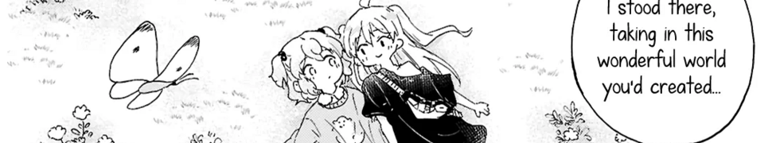

*"I love Dogs...but cats are cool too!"*
---

---
### About Me:
- **Occupation**: (Desktop) Application Developer
- **Languages**: C# (.NET), Python, HTML/CSS/JS, Lua
- **Interests**: [GUI Programming](https://github.com/iLollek/CTkVisualizer), [Game Modding](https://github.com/iLollek/NRPFarMod) and Ethical Hacking
---

---
### Favourite Music, Films, Media, etc.

Below is an uncurated and unsorted list of my favourite Media

#### Anime / Manga:
- [Neon Genesis Evangelion](https://en.wikipedia.org/wiki/Neon_Genesis_Evangelion)
- [Serial Experiments Lain](https://en.wikipedia.org/wiki/Serial_Experiments_Lain)
- [Cyberpunk: Edgerunners](https://en.wikipedia.org/wiki/Cyberpunk:_Edgerunners)
- [Nichijou](https://en.wikipedia.org/wiki/Nichijou)
- [Initial D](https://en.wikipedia.org/wiki/Initial_D)

#### Music:
- [Sewerslvt](https://music.fandom.com/wiki/Sewerslvt)
- [emmcare](https://soundcloud.com/emmcloud)
- [strxwberrymilk](https://soundcloud.com/strxw)
- [Pendulum](https://en.wikipedia.org/wiki/Pendulum_(drum_and_bass_band))
- [Skaven (Peter Hajba)](https://en.wikipedia.org/wiki/Peter_Hajba)
- Also [Vocaloid](https://en.wikipedia.org/wiki/Vocaloid), [Mixtapes](https://www.youtube.com/watch?v=InD4Ev5hZWE), [Camellia](https://en.wikipedia.org/wiki/Camellia_(musician)) and mostly anything [DnB](https://en.wikipedia.org/wiki/Drum_and_bass).

#### Video Games:
- [Jak and Daxter](https://en.wikipedia.org/wiki/Jak_and_Daxter)
- [Splatoon](https://en.wikipedia.org/wiki/Splatoon)
- [Minecraft](https://en.wikipedia.org/wiki/Minecraft)
- [CS:GO](https://en.wikipedia.org/wiki/Counter-Strike:_Global_Offensive)
- [Half-Life](https://en.wikipedia.org/wiki/Half-Life_(series))

---

*"Man stürzt keinen Palast - sondern lässt ihn leer stehen."*

---

  

